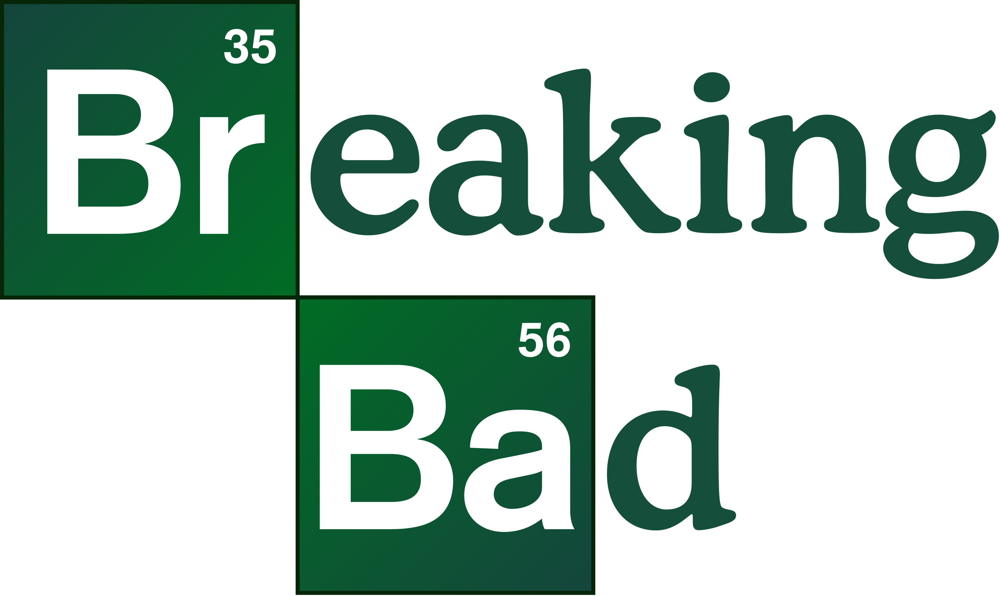

**TV Show: Breaking Bad**

*Breaking Bad* is an American television series created by Vince Gilligan that aired from 2008 to 2013. It stars *Bryan Cranston* as Walter White, a high school chemistry teacher turned methamphetamine manufacturing drug dealer, and *Aaron Paul* as his former student and business partner, Jesse Pinkman. *Breaking Bad* explores the transformation of Walter White from a mild-mannered teacher into a ruthless and feared criminal mastermind in the world of methamphetamine production. The show delves into themes of morality, identity, and the consequences of one's actions. *Breaking Bad* has been widely acclaimed for its writing, acting, and character development, becoming a cultural phenomenon and garnering a dedicated fanbase.

**Logo:**

{width=400}

**Summary of Basic Statistics:**

Breaking Bad garnered significant viewership and critical acclaim throughout its run. Here are some key statistics:

- The first season of Breaking Bad averaged around 1.2 million viewers per episode.
- The viewership numbers steadily increased over the seasons, with the final season attracting over 10 million viewers per episode.
- Breaking Bad's series finale, titled "Felina," drew a record-breaking audience of 10.3 million viewers.
- The show consistently received high ratings and maintained a strong viewership base, contributing to its reputation as a cultural phenomenon.

