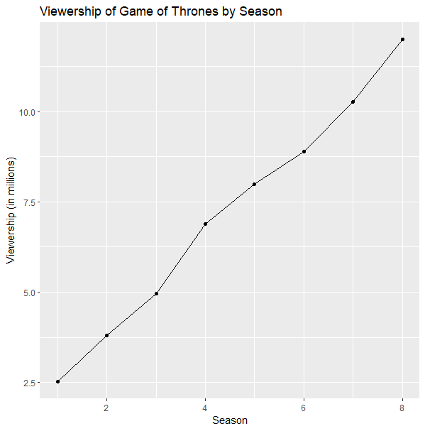

```{r setup, include=FALSE}
knitr::opts_chunk$set(echo = TRUE)
```

## Brief description 
Game of Thrones is a fantasy drama television series created by David Benioff and D. B. Weiss. The show is based on George R. R. Martin's series of fantasy novels, A Song of Ice and Fire. It premiered on HBO on April 17, 2011, and concluded on May 19, 2019, with a total of 73 episodes over eight seasons.
## A photo with the logo or a shot from the show itself.


Game of Thrones Logo


## Basic Statistics
According to HBO, the final season of Game of Thrones had an average of 44.2 million viewers per episode, including delayed viewing.
The show was a critical and commercial success, receiving numerous awards and nominations throughout its run, including 59 Primetime Emmy Awards, the most for any drama series.
A Report on "Game of Thrones" TV Show Game of Thrones is a fantasy drama television series created by David Benioff and D. B. Weiss. The show is based on George R. R. Martin's series of fantasy novels, A Song of Ice and Fire. It premiered on HBO on April 17, 2011, and concluded on May 19, 2019, with a total of 73 episodes over eight seasons.

## Viewership Over Time
Here is a graph showing the viewership of each season of Game of Thrones over time: 

### code block
library(ggplot2)

seasons <- c(1, 2, 3, 4, 5, 6, 7, 8)
viewership <- c(2.52, 3.80, 4.97, 6.88, 7.99, 8.89, 10.26, 11.99)

ggplot(data = data.frame(seasons, viewership)) + 
  geom_line(aes(x = seasons, y = viewership)) + 
  geom_point(aes(x = seasons, y = viewership)) + 
  xlab("Season") + 
  ylab("Viewership (in millions)") + 
  ggtitle("Viewership of Game of Thrones by Season")
  

  