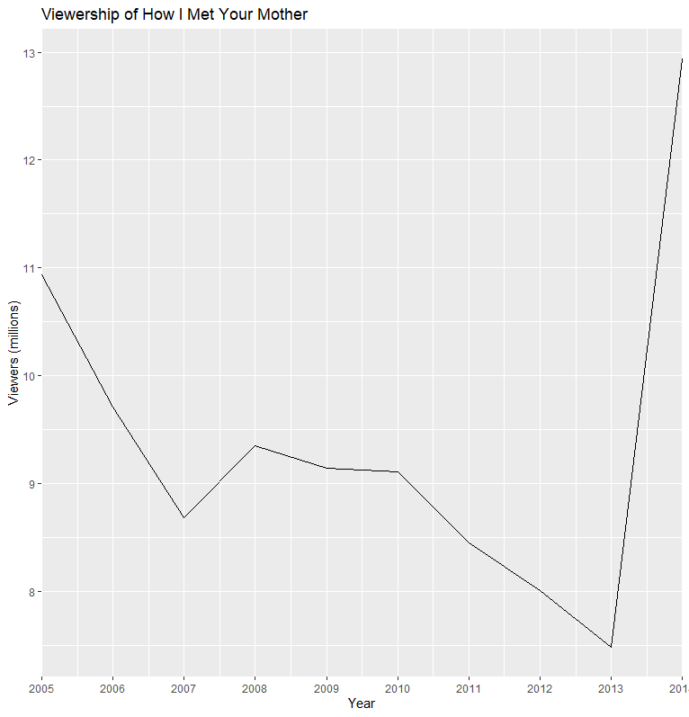
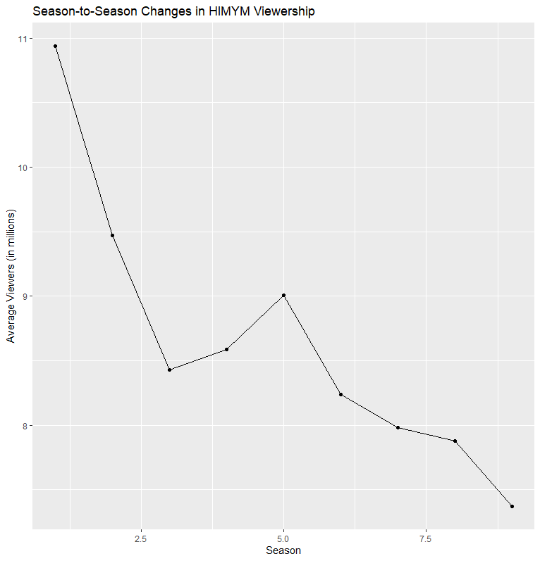

# _How I Met Your Mother_

## Brief Description
"How I Met Your Mother" (often abbreviated as HIMYM) is an American sitcom, created by Craig Thomas and Carter Bays for CBS. The series, which aired from September 19, 2005, to March 31, 2014, follows the main character, Ted Mosby, and his group of friends in New York City's Manhattan. As a framing device, Ted, in 2030, recounts to his son, Luke, and daughter, Penny, the events from September 2005 to May 2013 that led him to meet their mother. "How I Met Your Mother" is a joint production by Bays & Thomas Productions and 20th Century Fox Television and syndicated by 20th Television (now Disney-ABC Domestic Television).

The series was loosely inspired by Thomas and Bays' friendship when they both lived in New York. The vast majority of episodes were directed by Pamela Fryman, who directed 196 episodes out of 208. The other directors were Rob Greenberg (7 episodes), Michael Shea (4 episodes), and Neil Patrick Harris (1 episode).

Known for its unique structure, humor, and incorporation of dramatic elements, "How I Met Your Mother" was popular throughout its run. It initially received positive reviews upon release, but reception became more mixed as the seasons went on. The show was nominated for 91 awards and received 21. In 2010, Alyson Hannigan won the People's Choice Award for Favorite TV Comedy Actress. In 2012, seven years after its premiere, the series won the People's Choice Award for Favorite Network TV Comedy, and Neil Patrick Harris won the award for Favorite TV Comedy Actor twice.

# Basic Statistics for How I Met Your Mother (HIMYM)

Here are some basic statistics for the TV show "How I Met Your Mother":

- Total number of seasons: 9
- Total number of episodes: 208
- Average episode length: 22 minutes
- Total runtime: 91 hours and 16 minutes
- First episode air date: September 19, 2005
- Last episode air date: March 31, 2014

## Ratings

- IMDb rating: 8.3/10
- Rotten Tomatoes score: 83%
- Metacritic score: 69/100

## Awards

- Primetime Emmy Awards: 10 wins and 72 nominations
- People's Choice Awards: 8 wins and 21 nominations
- Golden Globe Awards: 2 nominations

# A graph of the viewership over time

### code block

**Load necessary packages**

library(tidyverse)

**Create a data frame with viewership data**

himym <- data.frame(
  year = c(2005, 2006, 2007, 2008, 2009, 2010, 2011, 2012, 2013, 2014),
  viewers = c(10.94, 9.71, 8.68, 9.35, 9.14, 9.11, 8.45, 8.01, 7.48, 12.94)
)

**Create a plot with the x-axis showing only integers**

ggplot(himym, aes(x = year, y = viewers)) +
  geom_line() +
  scale_x_continuous(breaks = himym$year, expand = c(0,0)) +
  labs(x = "Year", y = "Viewers (millions)", title = "Viewership of How I Met Your Mother")

# A graph of the episode-to-episode (or season-to-season) changes ratings

**Create a data frame with the season-to-season viewership data**

viewership <- data.frame(
  season = 1:9,
  viewers = c(10.94, 9.47, 8.43, 8.59, 9.01, 8.24, 7.98, 7.88, 7.37)
)

**Create a line graph using ggplot2**

library(ggplot2)

ggplot(viewership, aes(x = season, y = viewers)) +
  geom_line() +
  geom_point() +
  labs(title = "Season-to-Season Changes in HIMYM Viewership", x = "Season", y = "Average Viewers (in millions)")

